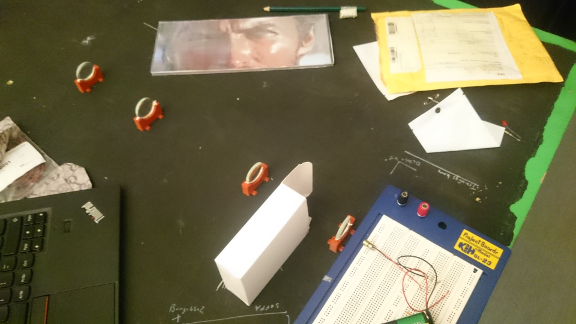

:title: Tisdagshack och Fouriertransformen
:date: 2015-01-13 18:00
:category: Blog
:tags: sparvnastet
:slug: fourier
:authors: Sparven
:summary: En helt vanlig Tisdag...

På senaste tisdagshacket snöade vi in på `Fouriertransformen
<http://en.wikipedia.org/wiki/Fourier_transform>`_ rätt rejält.

Först experimenterade vi med laser och `fourieroptik.
<http://en.wikipedia.org/wiki/Fourier_transform>`_. Det var kul men
visade sig svårt att få bra resultat med vår quick-n-dirty labmiljö:

Av en ren slump dök det sedan upp en ny sparv som var expert på
Fouriertransformen och dess diskreta standardalgoritm FFT. Mycket
oväntat och kul.

Nästa tisdag kommer det antagligen inte att handla om
Fouriertransformen utan om något helt annat. Ta med ditt projekt eller
några ideer och kom förbi!
